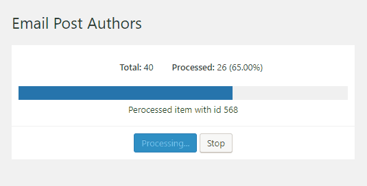

# WP Batch Processing

WP Batch Processing is WordPress plugin for creating batches of data and processing the data items one by one. It allows you to define a batch and to process the queued batch items one by one. There is also option to resume/continue later in case your internet connection goes down.
 


## Installation

There are two ways to install this library:

1. Install this library as a plugin. It doesn't require anything from below or,

2. Install it as a composer package (read the **notes** bellow)

```
composer require gdarko/wp-batch-processing
```

```php
WP_Batch_Processor::boot();
```

**Note**: The `boot()` method should be called only if you install the plugin via composer somewhere in your plugin or theme.

**Note**: If using composer, the library will attempt to find its path, however if you see messed up screen it means that it was unable to find the stylesheet/JS files and you will need to define them manually before `boot()` method.

```php
// Manually define the path constants to eliminate
// possible errors when resolving the paths and also
// include trailing slash at the end.

if ( ! defined('WP_BP_PATH')) {
    define('WP_BP_PATH', '/path/to/wp-content/plugins/your-plugin/libraries/wp-batch-processing/');
}

if ( ! defined('WP_BP_URL')) {
    define('WP_BP_URL', 'https://site.com/wp-content/plugins/your-plugin/libraries/wp-batch-processing/');
}

WP_Batch_Processor::boot();
```


## How it works

To define a batch you just need to extend the class `WP_Batch` and later register it. Follow  the examples below to learn how.

The class provides the following attributes and methods 

* `$id` - Identifies the batch (must be unique),
* `$title` - Shown in the admin area,
* `setup()` - Method that you use it to fed your data with `WP_Batch_Item` instances,
* `process(WP_Batch_Item $item)` - Method that will be used to process each next item in the batch

```php

if ( class_exists( 'WP_Batch' ) ) {

	/**
	 * Class MY_Example_Batch
	 */
	class MY_Example_Batch extends WP_Batch {

		/**
		 * Unique identifier of each batch
		 * @var string
		 */
		public $id = 'email_post_authors';

		/**
		 * Describe the batch
		 * @var string
		 */
		public $title = 'Email Post Authors';

		/**
		 * To setup the batch data use the push() method to add WP_Batch_Item instances to the queue.
		 *
		 * Note: If the operation of obtaining data is expensive, cache it to avoid slowdowns.
		 *
		 * @return void
		 */
		public function setup() {

			$users = get_users( array(
				'number' => '40',
				'role'   => 'author',
			) );

			foreach ( $users as $user ) {
				$this->push( new WP_Batch_Item( $user->ID, array( 'author_id' => $user->ID ) ) );
			}
		}

		/**
		 * Handles processing of batch item. One at a time.
		 *
		 * In order to work it correctly you must return values as follows:
		 *
		 * - TRUE - If the item was processed successfully.
		 * - WP_Error instance - If there was an error. Add message to display it in the admin area.
		 *
		 * @param WP_Batch_Item $item
		 *
		 * @return bool|\WP_Error
		 */
		public function process( $item ) {

			// Retrieve the custom data
			$author_id = $item->get_value( 'author_id' );

			// Return WP_Error if the item processing failed (In our case we simply skip author with user id 5)
			if ( $author_id == 5 ) {
				return new WP_Error( 302, "Author skipped" );
			}

			// Do the expensive processing here.
			// ...

			// Return true if the item processing is successful.
			return true;
		}
		
		/**
		 * Called when specific process is finished (all items were processed).
		 * This method can be overriden in the process class.
		 * @return void
		 */
		public function finish() {
			// Do something after process is finished.
			// You have $this->items, etc.
		}
	}
}

```

After creating the class, class instance needs to be registered in order to be available in the batches list in the admin area.

```php
/**
 * Initialize the batches.
 */
function wp_batch_processing_init() {
    $batch = new MY_Example_Batch();
    WP_Batch_Processor::get_instance()->register( $batch );
}
add_action( 'wp_batch_processing_init', 'wp_batch_processing_init', 15, 1 );
```

That's it.

## Filters and Actions

Set delay between processing items. Default is 0 (no delay)
```php
function wp_bp_my_custom_delay($delay) {
   return 2; // in seconds
}
add_filter('wp_batch_processing_delay', 'wp_bp_my_custom_delay', 10, 1);
```

## Example use cases

The tool can be used in many different ways. For example

* Importing data
* Downloading data
* Emailing
* Database modifications


## Contribute

If you notice a bug or you want to propose improvements feel free to create a pull request!


## License

The plugin is licensed under GPL v2

```
Copyright (C) 2021 Darko Gjorgjijoski (https://darkog.com)

This file is part of WP Batch Processing

WP Batch Processing is free software: you can redistribute it and/or modify
it under the terms of the GNU General Public License as published by
the Free Software Foundation, either version 2 of the License, or
(at your option) any later version.

WP Batch Processing is distributed in the hope that it will be useful,
but WITHOUT ANY WARRANTY; without even the implied warranty of
MERCHANTABILITY or FITNESS FOR A PARTICULAR PURPOSE.  See the
GNU General Public License for more details.

You should have received a copy of the GNU General Public License
along with WP Batch Processing. If not, see <https://www.gnu.org/licenses/>.
```
